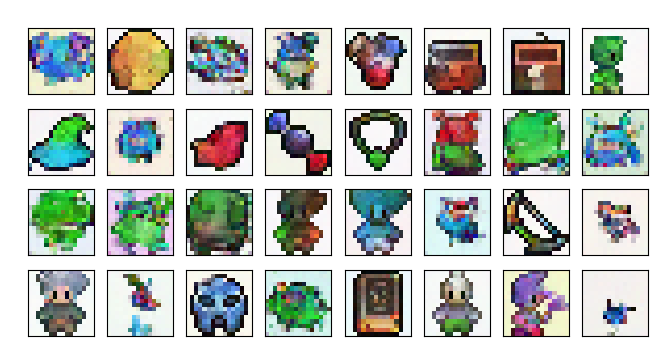

## Project for generating 8-bit sprites using Diffusion Model

## 1. Requirements
In order to run this project you need to install required packages from ```requirements.txt``` file. You can do it by running the following command:
```pip3 install -r requirements.txt```

## 2. Training
- In order to run default training, you need to run the following command:
```./train_default.sh```
- In order to run training with custom parameters, you need to run the following command:
```python3 train.py ```
In this case you need to specify trainig params (see ```python3 train.py --help``` for more details)


## 3. Generation
- In order to run default generation, you need to run the following command:
```python3 inference.py --weights-path <path to model weights> --sprite-class <class of sprite>```
Sprites sprites have to be one of the following: ```hero, non-hero, food, spell, side-facing```

## 4. Results
Sprites generated after 32 epochs of training:


## 5. Acknowledgments
Sprites by ElvGames, [FrootsnVeggies](https://zrghr.itch.io/froots-and-veggies-culinary-pixels) and  [kyrise](https://kyrise.itch.io/)   
This code is modified from, https://github.com/cloneofsimo/minDiffusion   
Diffusion model is based on [Denoising Diffusion Probabilistic Models](https://arxiv.org/abs/2006.11239) and [Denoising Diffusion Implicit Models](https://arxiv.org/abs/2010.02502)  
Based on the course from [DeepLearingAI](https://www.deeplearning.ai/short-courses/how-diffusion-models-work/)